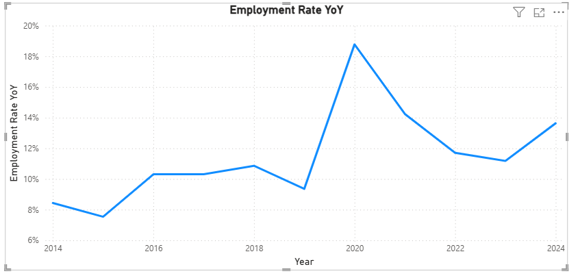
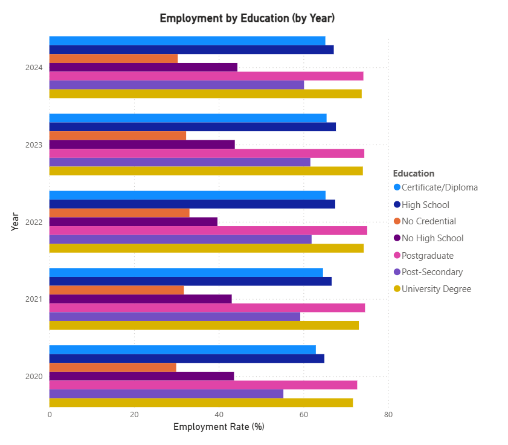
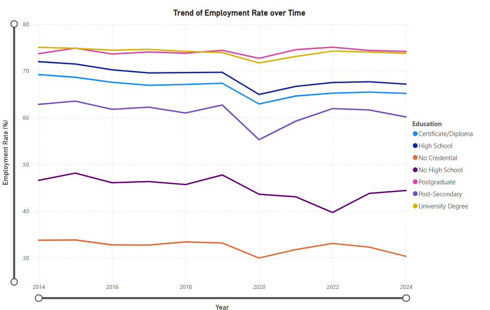
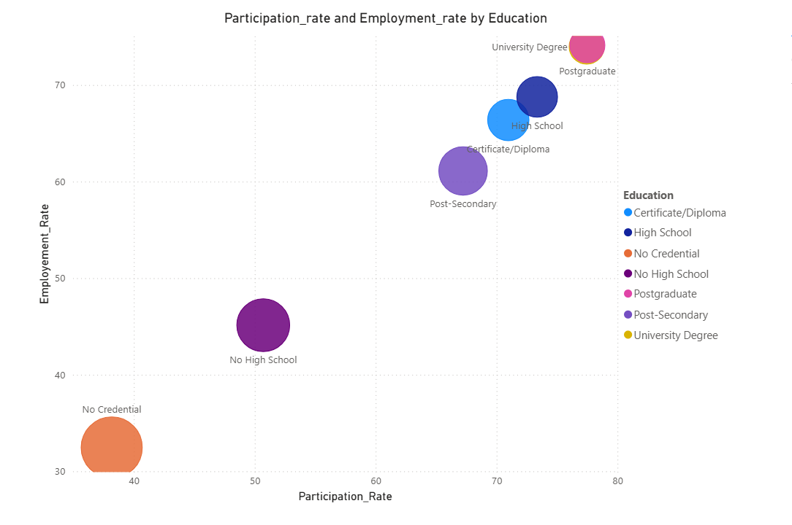

# Power BI Build Guide (from final_labour_force.csv)

## Fields detected
- Year: `year`
- Geography: `geo`
- Sex: `gender`
- Age group: `age_group`
- Education: `education`
- Employment rate: `employment_rate`
- Unemployment rate: `unemployment_rate`
- Participation rate: `participation_rate`

## Steps
1. Get Data → Text/CSV → `final_labour_force.csv` → Transform Data.
2. Set types: `year` = Whole Number; rate columns = Decimal.
3. Close & Apply.
4. Create measures from `DAX_Measures.txt`.
5. Visuals:
   - Bar: Education vs Employment → Axis=`education`, Values=`[Avg Employment Rate]`.
   - Line: Employment trend over time → X=`year`, Y=`[Avg Employment Rate]`, Legend=`education`.
   - Scatter: Participation vs Employment → X=`[Avg Participation Rate]`, Y=`[Avg Employment Rate]`, Details=`education`, Play=`year`.
   - Column: Unemployment by education → Axis=`education`, Values=`[Avg Unemployment Rate]`.
   - KPI Cards: `[Avg Employment Rate]`, `[Avg Participation Rate]`, `[Avg Unemployment Rate]`.
6. Slicers: `year`, `geo`, `gender`, `age_group`.
7. Optional: Add Date table for YoY (see DAX file).

## 10 Insights
## 🖼️ Dashboard Preview Placeholders

| Page | Screenshot |
|------|-------------|
| **Employment_Change Overview** |  |
| **Employment_Education Comparison** |  |
| **Trend of Employment_Rate** |  |
| **ParticipationRate_and_EmploymentRate_By_Education** |  |

### Stakeholder Insights (Top 10)

1. Latest year (2024) averages — Employment: 60.4%, Unemployment: 7.3%, Participation: 64.6%.
2. Employment rate changed by +2.8 pts from 2020 to 2024 (avg 57.6% → 60.4%).
3. In 2024, Postgraduate has the highest employment rate at 74.2%.
4. Education gap (employment) in 2024: Postgraduate vs No Credential = 43.8 pts.
5. Alberta has the highest participation rate in 2024 at 68.9%.
6. Lowest unemployment in 2024: Quebec at 5.9%.
7. Gender gap in 2024 (employment rate): Men 62.6% vs Women 57.8% (4.8 pts).
8. Top age group by employment in 2024: 15 years and over at 60.4%.
9. Education (ordinal) vs employment correlation: 0.27.
10. Participation vs Employment correlation: 0.99.